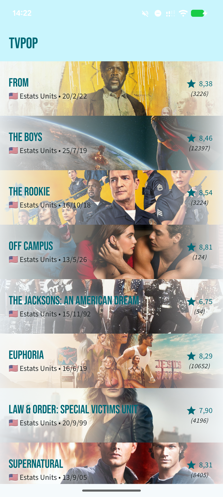
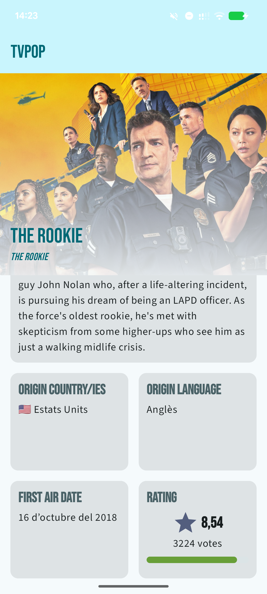

# Prueba técnica Android junior para Doonamis: TVPop

 

Esta aplicación es una prueba técnica para Doonamis. *TVPop* es una aplicación nativa de Android
programada en Kotlin y basada en Jetpack Compose que muestra las series más populares obtenidas de
TMDB.

## Funcionalidades

En abrir la aplicación, se muestra la **lista** de las series obtenidas de TMDB. En presionar sobre
una serie, se muestran los **detalles** de esta.

| Lista de series                                                                | Detalles de una serie                                                               |
|--------------------------------------------------------------------------------|-------------------------------------------------------------------------------------|
|  |  |

## Versiones

Se han incluido tres versiones de la aplicación correspondientes con las versiones pedidas en la
especificación. Para cada versión, se ha creado un lanzamiento y una etiqueta al commit
correspondiente. Cada lanzamiento incluye un binario APK producido por GitHub Actions.

Las versiones 1.0 y 2.0 incluyen las funcionalidades obligatorias. La versión 3.0 incluye una
funcionalidad opcional.

* **Versión 1.0** - *[código](https://github.com/usern132/TVPop/releases/tag/v1.0)* |
  *[lanzamiento (APK)]([código](https://github.com/usern132/TVPop/tree/v1.0))*
    * Listado
    * Detalle
* **Versión 2.0** - *[código](https://github.com/usern132/TVPop/releases/tag/v2.0)* |
  *[lanzamiento (APK)]([código](https://github.com/usern132/TVPop/tree/v2.0))*
    * TODO
* **Versión 3.0** - *[código](https://github.com/usern132/TVPop/releases/tag/v3.0)* |
  *[lanzamiento (APK)]([código](https://github.com/usern132/TVPop/tree/v3.0))*
    * TODO

## Compilación

Antes de compilar el proyecto, es necesario especificar tu clave de la API de TMDB para poder
autenticar las peticiones. Rellena su valor en el fichero `local.properties` (generado por Android
Studio en la raíz del proyecto) a partir de la plantilla proporcionada, [
`local.properties.template`](local.properties.template). Copia el contenido de la plantilla al final
de `local.properties` y rellena el valor de la clave.

## Aspectos técnicos

### Arquitectura

Se ha usado la arquitectura **MVVM** (Model-View-ViewModel).

### Inyección de dependencias

Se ha usado la librería **[Koin](https://insert-koin.io)** por su simplicidad de configuración y
sintaxi simplificada en
comparación con [Hilt](https://dagger.dev/hilt/). Además, únicamente había probado Hilt antes de
empezar este proyecto y ha
sido una buena oportunidad para entrar en contacto con Koin.