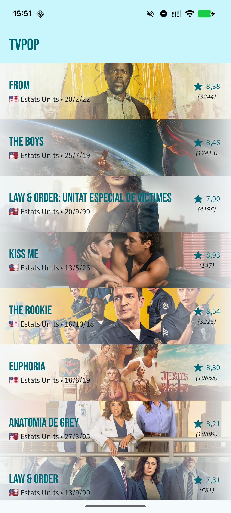
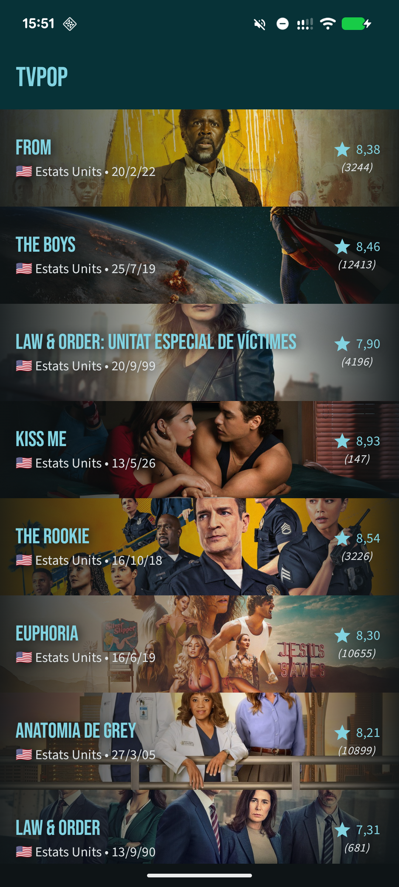
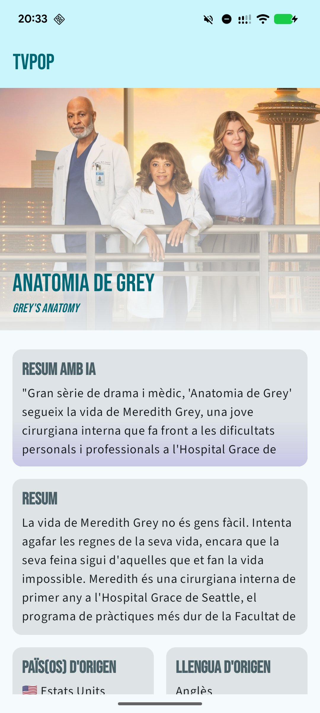
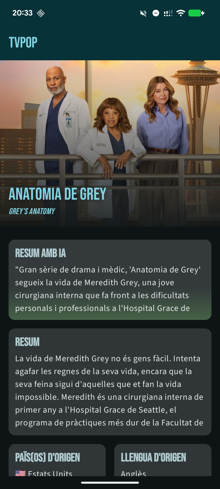

# Prueba técnica Android junior para Doonamis: TVPop

 

Esta aplicación es una prueba técnica para Doonamis. *TVPop* es una aplicación nativa de Android
programada en Kotlin y basada en Jetpack Compose que muestra las series más populares obtenidas de
TMDB.

## Funcionalidades

En abrir la aplicación, se muestra la **lista** de las series obtenidas de TMDB. En presionar sobre
una serie, se muestran los **detalles** de esta.

Una vez cargadas desde la red, las series se mantienen almacenadas localmente para ser accedidas
**sin conexión** y servir como caché. Cuando se dispone de conexión, se puede actualizar la lista
manualmente deslizando desde la parte superior. La caché se regenera en abrir la aplicación tras un
periodo de 15 minutos desde la última carga.

| Lista de series                                                                                                                                                                                       | Detalles de una serie                                                                                                                                                                                           |
|-------------------------------------------------------------------------------------------------------------------------------------------------------------------------------------------------------|-----------------------------------------------------------------------------------------------------------------------------------------------------------------------------------------------------------------|
|   |   |

## Versiones

Se han incluido tres versiones de la aplicación correspondientes con las versiones pedidas en la
especificación. Para cada versión, se ha creado un lanzamiento y una etiqueta al commit
correspondiente. Cada lanzamiento incluye un binario APK producido por GitHub Actions.

Las versiones 1.0 y 2.0 incluyen las funcionalidades obligatorias. La versión 3.0 incluye una
funcionalidad opcional.

* **Versión 1.0** - *[código](https://github.com/usern132/TVPop/tree/v1.0)* |
  *[lanzamiento (APK)](https://github.com/usern132/TVPop/releases/tag/v1.0)*
    * Listado de series
    * Detalle de una serie
* **Versión 2.0** - *[código](https://github.com/usern132/TVPop/tree/v2.0)* |
  *[lanzamiento (APK)](https://github.com/usern132/TVPop/releases/tag/v2.0)*
    * Funcionamiento sin conexión tras una carga inicial
    * Multiidioma (en función del idioma del sistema)
        * Catalán
        * Español
        * Inglés
* **Versión 3.0** - *[código](https://github.com/usern132/TVPop/tree/v3.0)* |
  *[lanzamiento (APK)](https://github.com/usern132/TVPop/releases/tag/v3.0)*
    * TODO

## Compilación

Antes de compilar el proyecto, es necesario especificar tu clave de la API de TMDB y de la API de
Groq para poder autenticar las peticiones. Rellena su valor en el fichero `local.properties`
(generado por Android Studio en la raíz del proyecto) a partir de la plantilla proporcionada, [
`local.properties.template`](local.properties.template). Copia el contenido de la plantilla al final
de `local.properties` y rellena el valor de la clave.

## Aspectos técnicos

### Arquitectura

Se ha usado la arquitectura **MVVM** (Model-View-ViewModel).

### Inyección de dependencias

Se ha usado la librería **[Koin](https://insert-koin.io)** por su simplicidad de configuración y
sintaxi simplificada en
comparación con [Hilt](https://dagger.dev/hilt/). Además, únicamente había probado Hilt antes de
empezar este proyecto y ha
sido una buena oportunidad para entrar en contacto con Koin.

### Almacenaje local

Se ha usado la librería **[Room](https://developer.android.com/training/data-storage/room/)** para
mantener una
cópia local de las series obtenidas de TMDB a modo de caché.

### Paginación

Se ha usado la librería
**[Paging](https://developer.android.com/topic/libraries/architecture/paging/v3-overview)** para
obtener las series de TMDB por páginas, de modo que solo se cargan las series a medida que el
usuario se desplaza por la lista. Además, la librería también se ha usado para gestionar el guardado
en caché de las series una vez recuperadas de TMDB.

## Problemas detectados

En mi dispositivo Android de prueba (Google Pixel 6, Android 16 CP1A.260405.005), el uso de un
lenguaje del sistema diferente al catalán, español o inglés provoca un error en Ktor durante la
descompresión de la respuesta recibida por la API
(ver
[TMDBRemoteSource](app/src/main/java/com/silliconpowerinc/tvpop/data/sources/TMDBRemoteSource.kt)):

> REQUEST https://api.themoviedb.org/3/tv/popular?language=en-US&page=1 failed with exception:
> io.ktor.utils.io.ClosedByteChannelException: gzip finished without exhausting source

Aun especificando el idioma "en-US" como opción por defecto cuando el idioma del sistema no
es uno de los tres idiomas soportados en la aplicación, el problema sigue ocurriendo hasta volver a
establecer un idioma soportado.

La petición funciona correctamente con `curl` en Linux en cualquier idioma, pero no en la
aplicación.

Tras no llegar a una resolución del problema, he procedido con las otras funcionalidades.

## Uso de IA en el desarrollo

Se ha usado el agente de **Gemini** integrado en Android Studio para la mayoría de consultas (con el
modelo
_gemini-3-flash-preview_). Se ha usado
principalmente en modo "Ask" (sin acceso a herramientas para modificar ficheros) y así poder:

* Evitar modificaciones indeseadas en el código.
* Revisar mejor las propuestas antes de ser integradas.
* Ser más consciente de los cambios planteados.
* Integrar las modificaciones dentro de la arquitectura y formato establecidos.

Como segunda opción, se ha usado el cliente web de **Claude** para discusiones más generales que no
requieren el contexto del proyecto. Por ejemplo, para discutir decisiones arquitectónicas antes de
empezar el proyecto o para
configurar [un flujo de GitHub Actions para crear lanzamientos automáticamente](.github/workflows/release.yml).

En el caso del problema con los lenguajes detallado en la sección anterior, se ha usado **GPT 5.2
Codex** con GitHub Copilot en modo agente para investigar el problema.

En aquellos commits donde se ha usado una parte sustancial de código o ideas sugeridas por Gemini,
este se ha marcado como co-autor. En toda ocasión se ha revisado y adaptado el código sugerido.